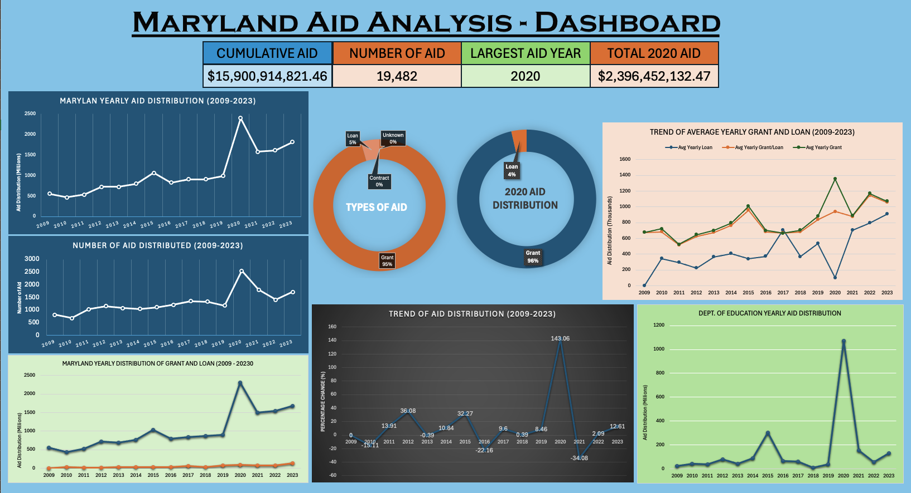

<h1 style="text-align: center">Maryland Aid Analysis (2009 - 2023) </h1>
 
This study examines aid distributed by the State of Maryland from 2009 to 2023. The goals are to analyze how much aid Maryland distributed, which departments or agencies provided the most aid, and which agencies or programs received the most aid. Another goal is to <b>identify trends</b> in the aid distribution over the years, including the <b>impact of the COVID-19 pandemic</b> on Maryland's aid distribution. Additionally, the study seeks to understand what Maryland prioritizes and where most of its funding is allocated.

## Table of Content
- [How data was obtained](#how-data-was-obtained)
- [Technologies Used](#technologies-used)
- [Key Finding](#key-finding)
- [Summary](#summary)
- [Comprehensive Analysis and Interpretation](#comprehensive-analysis-and-interpretation)
    - [General Overview of Maryland Aid (2009 - 2023)](#general-overview-of-maryland-aid-2009---2023)
    - [Trends and Patterns](#trends-and-patterns)
    - [Aid Categories and Distribution](#aid-categories-and-distribution)
    - [Peak Year and Covid-19 Pandemic Aid Distribution](#peak-year-and-covid-19-pandemic-aid-distribution)
    - [Top Recipients and Givers](#top-recipients-and-givers)
    - [Department Analysis](#department-analysis)
    - [Aid Amount Analysis](#aid-amount-analysis)

## How data was obtained
All the data was obtained from Maryland Open Data Portal

## Technologies Used
- Excel for cleaning, data presentation, and dashboard
- PostgreSQL for cleaning, and analysis
- DataGrip—IDE for PostgreSQL

## Key Finding
- Maryland distributed over $15 billion in aid from 2009 to 2023, reflecting a significant commitment to supporting various state agencies and programs.
- The state provided a total of 19,482 individual aid distributions during this period, indicating extensive efforts to address diverse needs across Maryland.
- Maryland's aid distribution shows a general upward trend from 2009 to 2023, with a particularly significant increase between 2019 and 2020, largely due to the COVID-19 pandemic. The total aid distributed nearly doubled from less than 1 billion annually before 2020 to over 2.3 billion in 2020.
- The year 2020 saw the highest aid distribution, with a **143%** increase from 2019, due to the pandemic. However, aid distribution decreased by 34.08% in 2021 as the immediate crisis was over. From 2021 to 2023, aid amounts stabilized and returned to more regular funding patterns.
- Grants made up 95% of the total aid distributed, amounting to over $15 billion, while loans accounted for about 4.5%. This indicates Maryland's strong reliance on grants to support its operations and programs.
- The Department of Transportation was the largest provider of aid, followed by the Department of Education and the Maryland Higher Education Commission. The Washington Metropolitan Area Transit Authority and Washington Suburban Transit were the top recipients, followed by the Maryland State Retirement System and Johns Hopkins University.
- The Department of Education distributed $2.2 billion in aid (13.89% of total aid) from 2009 to 2023, with a significant spike in 2020 due to the pandemic. Aid levels decreased after 2020 as schools reopened for in-person instruction.
- While most aid was distributed within Maryland, some aid went to out-of-state and foreign organizations, highlighting Maryland's involvement in broader partnerships.
- There was a steady increasing trend in the average yearly aid amount per grant and per loan, indicating a growing investment in individual aid distributions over time.

## Summary
The analysis reveals Maryland's consistent support for various agencies and programs, with notable fluctuations in aid distribution due to external events such as the COVID-19 pandemic. The data shows Maryland's priorities in transportation, education, and healthcare, as well as its reliance on grants to fund state operations.

For more detailed and comprehensive analysis, please read below

## Comprehensive Analysis and Interpretation
There are serious of questions to guide the analysis of Maryland's aid distribution

### General Overview of Maryland Aid (2009 - 2023)
1. **Question 1:** How much total aid did Maryland distribute from 2009 to 2023?
```postgresql
SELECT
    TO_CHAR(SUM(amount), '$FM999,999,999,999.00') AS total_aid_amount
FROM
    maryland_aids_09_23;
```
| total_aid_amount    |
|:-------------------:|
| $15,900,914,821.46 |

Maryland distributed over $15 billion in aid from 2009 to 2023. This substantial amount reflects Maryland's commitment to supporting numerous agencies and programs, highlighting the operational costs required to manage various departments within the state government.

2. **Question 2:** How many individual aid distributions did Maryland make from 2009 to 2023?

```postgresql
SELECT
    COUNT(*) AS num_of_records
FROM
    maryland_aids_09_23;
```

| num_of_records |
|:--------------:|
|     19482      |

Maryland provided a total of 19,482 individual aids, which shows the state's extensive efforts in supporting a wide range of needs.

### Trends and Patterns
3. **Question 3:** What is the trend in the total amount of aid distributed from 2009 to 2023?

```postgresql
SELECT
    fiscal_year,
    TO_CHAR(SUM(amount), '$FM999,999,999,999.00') AS total_aids,
    RANK() OVER (ORDER BY SUM(amount) DESC)
FROM
    maryland_aids_09_23
GROUP BY
    fiscal_year
ORDER BY
    fiscal_year;
```

| fiscal_year |     total_aids     | rank |
|:-----------:|:------------------:|-----:|
|     2009    |  $552,274,922.22   |   13 |
|     2010    |  $468,824,406.89   |   15 |
|     2011    |  $534,060,484.97   |   14 |
|     2012    |  $726,726,970.33   |   11 |
|     2013    |  $723,862,906.76   |   12 |
|     2014    |  $802,351,149.95   |   10 |
|     2015    | $1,061,257,284.94  |    5 |
|     2016    |  $826,133,142.66   |    9 |
|     2017    |  $905,479,311.53   |    8 |
|     2018    |  $909,053,635.53   |    7 |
|     2019    |  $985,965,431.93   |    6 |
|     2020    | $2,396,452,132.47  |    1 |
|     2021    | $1,579,702,378.00  |    4 |
|     2022    | $1,612,689,724.11  |    3 |
|     2023    | $1,816,080,939.17  |    2 |


There is a general upward trend in Maryland's aid distribution from 2009 to 2023. However, a significant increase occurred from 2019 to 2020, likely due to the COVID-19 pandemic. Before 2020, Maryland distributed less than one billion annually, but in 2020, this amount surged to over 2.3 billion. While aid was steadily increasing from 2009 to 2019, the pandemic caused a more drastic rise, likely as Maryland provided more support to help businesses, departments, and agencies remain operational during the crisis.

4. **Question 4:** What is the trend in the number of individual aids given out from 2009 to 2023?

```postgresql
SELECT
    fiscal_year,
    COUNT(*) AS num_of_aids,
    RANK() OVER ( ORDER BY COUNT(*) DESC)
FROM
    maryland_aids_09_23
GROUP BY
    fiscal_year;
```
| fiscal_year | num_of_aids | rank |
|:-----------:|:-----------:|-----:|
|     2020    |     2549     |    1 |
|     2021    |     1801     |    2 |
|     2023    |     1717     |    3 |
|     2022    |     1407     |    4 |
|     2017    |     1353     |    5 |
|     2018    |     1331     |    6 |
|     2016    |     1209     |    7 |
|     2019    |     1177     |    8 |
|     2012    |     1158     |    9 |
|     2015    |     1109     |   10 |
|     2013    |     1077     |   11 |
|     2014    |     1050     |   12 |
|     2011    |     1036     |   13 |
|     2009    |      819     |   14 |
|     2010    |      689     |   15 |


The data shows a correlation with the previous findings: Maryland distributed the highest number of individual aids in 2020 due to the pandemic. In 2020, over 2,500 different aids were given out, more than double the 1,100 aids distributed in 2019. However, following 2020, there was a downward trend in the number of aids distributed, possibly due to the decline in COVID-19 cases and the reopening of businesses, allowing people to return to work.

5. **Question 5:** Are there any inconsistencies between the total amount of aid and the number of aids given? For instance, was there a year when more individual aids were given, but the total aid amount was less compared to another year?

```postgresql
WITH
    total_aids AS (SELECT
                       fiscal_year,
                       TO_CHAR(SUM(amount), '$FM999,999,999,999.00') AS total_aids,
                       RANK() OVER ( ORDER BY SUM(amount) DESC) AS sum_aids_rank
                   FROM
                       maryland_aids_09_23
                   GROUP BY fiscal_year),
    aids_count AS (SELECT
                       fiscal_year,
                       COUNT(*) AS num_of_aids,
                       RANK() OVER ( ORDER BY COUNT(*) DESC) AS aids_count_rank
                   FROM
                       maryland_aids_09_23
                   GROUP BY fiscal_year)
SELECT
    ta.fiscal_year,
    ta.total_aids,
    ac.num_of_aids,
    ta.sum_aids_rank,
    ac.aids_count_rank
FROM
    total_aids ta,
    aids_count ac
WHERE
    ta.fiscal_year = ac.fiscal_year;
```

| fiscal_year |    total_aids     | num_of_aids | sum_aids_rank | aids_count_rank |
|:-----------:|:-----------------:|:-----------:|--------------:|----------------:|
|    2020     | $2,396,452,132.47 |     2549    |             1 |               1 |
|    2023     | $1,816,080,939.17 |     1717    |             2 |               3 |
|    2022     | $1,612,689,724.11 |     1407    |             3 |               4 |
|    2021     | $1,579,702,378.00 |     1801    |             4 |               2 |
|    2015     | $1,061,257,284.94 |     1109    |             5 |              10 |
|    2019     | $985,965,431.93   |     1177    |             6 |               8 |
|    2018     | $909,053,635.53   |     1331    |             7 |               6 |
|    2017     | $905,479,311.53   |     1353    |             8 |               5 |
|    2016     | $826,133,142.66   |     1209    |             9 |               7 |
|    2014     | $802,351,149.95   |     1050    |            10 |              12 |
|    2012     | $726,726,970.33   |     1158    |            11 |               9 |
|    2013     | $723,862,906.76   |     1077    |            12 |              11 |
|    2009     | $552,274,922.22   |      819    |            13 |              14 |
|    2011     | $534,060,484.97   |     1036    |            14 |              13 |
|    2010     | $468,824,406.89   |      689    |            15 |              15 |


Overall, the number of aids distributed and the total amount of aid generally align. However, 2015 stands out as an exception. Although 2015 ranks fifth in total aid amount, it ranks tenth in the number of aids given, indicating that fewer, but larger, aids were distributed in that year.

### Aid Categories and Distribution

6. **Question 6:** What are the different categories of aids distributed by Maryland?

```postgresql
SELECT
    category
FROM
    maryland_aids_09_23
GROUP BY
    category;
```
| category |
|:--------:|
|  Grant   |
|   Loan   |
| Unknown  |
| Contract |


Maryland provides four types of aid: Grant, Loan, Contract, and Unknown (where the type of aid is unspecified).

7. **Question 7:** Rank each aid category based on the total amount of aid distributed within that category.

```postgresql
SELECT
    category,
    TO_CHAR(SUM(amount), '$FM999,999,999,999.00') AS total_aid,
    RANK() OVER (ORDER BY SUM(amount) DESC) AS rank_order
FROM
    maryland_aids_09_23
GROUP BY
    category;
```

| category |     total_aid      | rank_order |
|:--------:|:------------------:|-----------:|
|  Grant   | $15,181,280,034.25 |          1 |
|   Loan   | $718,999,616.54    |          2 |
| Unknown  | $435,481.67        |          3 |
| Contract | $199,689.00        |          4 |


Grants are by far the largest category, totaling over 15 billion. The next highest category is loans, which amount to just over 700 million.

8. **Question 8:** What is the distribution of each aid type? For example, what percentage of total aid did grants and loans make up?

```postgresql
WITH
    category_totals AS (SELECT
                            category,
                            SUM(amount) AS category_total_aid
                        FROM
                            maryland_aids_09_23
                        GROUP BY category),
    overall_total AS (SELECT
                          SUM(amount) AS total_aid
                      FROM
                          maryland_aids_09_23)
SELECT
    ct.category AS category_type,
    TO_CHAR(ct.category_total_aid, '$FM999,999,999,999.00') AS total_aids,
    TRUNC(((ct.category_total_aid::NUMERIC / ot.total_aid) * 100), 3) AS "percentage (%)"
FROM
    category_totals ct,
    overall_total ot;
```
|  category_type  |     total_aids     | percentage (%) |
|:---------------:|:------------------:|---------------:|
|      Grant      | $15,181,280,034.25 |         95.474 |
|      Loan       | $718,999,616.54    |          4.521 |
|    Unknown      | $435,481.67        |          0.002 |
|    Contract     | $199,689.00        |          0.001 |


Grants account for 95% of the total aid distributed between 2009 and 2023. Loans make up about 4.5%, with the remaining categories making up less than 0.1%. This distribution highlights the significant role of grants in Maryland's operations and its support for various programs and departments.

### Peak Year and Covid-19 Pandemic Aid Distribution

9. **Question 9:** Which year did Maryland distribute the most aids?

```postgresql
WITH
    yearly_total AS (SELECT
                         fiscal_year,
                         SUM(amount) AS total_year_aid
                     FROM
                         maryland_aids_09_23
                     GROUP BY fiscal_year)
SELECT
    fiscal_year,
    TO_CHAR(total_year_aid, '$FM999,999,999,999.00') AS total_aid
FROM
    yearly_total
WHERE
    total_year_aid = (SELECT MAX(total_year_aid) FROM yearly_total);
```
| fiscal_year |     total_aid     |
|:-----------:|:-----------------:|
|     2020    | $2,396,452,132.47 |


Unsurprisingly, 2020 was the peak year for aid distribution, with Maryland providing $2.3 billion in aid.

10. **Question 10:** Since 2020 was the peak year for aid distribution, which was also the height of the Covid-19 pandemic, what was the percentage increase in aid from the previous year, and by what factor did it increase?

```postgresql
WITH
    calc_2019_aids AS (SELECT
                           fiscal_year,
                           SUM(amount) AS total_2019_aids
                       FROM
                           maryland_aids_09_23
                       WHERE
                           fiscal_year = 2019
                       GROUP BY fiscal_year),
    calc_2020_aids AS (SELECT
                           fiscal_year,
                           SUM(amount) AS total_2020_aids
                       FROM
                           maryland_aids_09_23
                       WHERE
                           fiscal_year = 2020
                       GROUP BY fiscal_year)
SELECT
    ROUND(((c20.total_2020_aids - c19.total_2019_aids) / (c19.total_2019_aids)) * 100, 2) AS "percentage_%",
    ROUND(((c20.total_2020_aids / c19.total_2019_aids)), 2) AS factor_increase
FROM
    calc_2019_aids c19,
    calc_2020_aids c20;
```
| percentage_% | factor_increase |
|:------------:|:---------------:|
|    143.06    |       2.43      |


In 2019, Maryland provided 985 million in aid, which jumped to 2.3 billion in 2020—a 143% increase. The factor increase was 2.43, meaning Maryland provided 2.43 times more aid in 2020 than in 2019. This dramatic rise was largely due to the COVID-19 pandemic.

11. **Question 11:** How has the total amount of aid distributed by Maryland changed year-over-year from 2009 to 2023, and what is the percentage increase or decrease each year compared to the previous year?

```postgresql
WITH
    calc_aids_yearly AS (SELECT
                             fiscal_year,
                             SUM(amount) AS total_yearly_aid
                         FROM
                             maryland_aids_09_23
                         GROUP BY fiscal_year
                         ORDER BY fiscal_year),
    previous_total_aid AS (SELECT
                               fiscal_year,
                               LAG(total_yearly_aid) OVER (ORDER BY fiscal_year) AS total_aids
                           FROM
                               calc_aids_yearly)
SELECT
    cay.fiscal_year,
    TO_CHAR(cay.total_yearly_aid, '$FM999,999,999,999.00'),
    ROUND(((cay.total_yearly_aid - pta.total_aids) / pta.total_aids) * 100, 2) AS percentage_increase
FROM
    calc_aids_yearly cay,
    previous_total_aid pta
WHERE
    cay.fiscal_year = pta.fiscal_year;
```
| fiscal_year |       to_char      | percentage_increase |
|:-----------:|:------------------:|--------------------:|
|     2009    |  $552,274,922.22   |                   0 |
|     2010    |  $468,824,406.89   |              -15.11 |
|     2011    |  $534,060,484.97   |               13.91 |
|     2012    |  $726,726,970.33   |               36.08 |
|     2013    |  $723,862,906.76   |               -0.39 |
|     2014    |  $802,351,149.95   |               10.84 |
|     2015    | $1,061,257,284.94  |               32.27 |
|     2016    |  $826,133,142.66   |              -22.16 |
|     2017    |  $905,479,311.53   |                9.60 |
|     2018    |  $909,053,635.53   |                0.39 |
|     2019    |  $985,965,431.93   |                8.46 |
|     2020    | $2,396,452,132.47  |              143.06 |
|     2021    | $1,579,702,378.00  |              -34.08 |
|     2022    | $1,612,689,724.11  |                2.09 |
|     2023    | $1,816,080,939.17  |               12.61 |


Seeing the difference between 2019 and 2020, I also wanted to investigate the overall percentage increases and decreases from 2009 to 2023. There is a steady fluctuation between 2009 and 2019, with slight increases and decreases in the overall trend during those years. In 2010, there was a 15.11% decrease in aid compared to 2009, which could indicate budget cuts or possible reallocations. Conversely, in 2012, there was a significant 36.08% increase, possibly indicating more budget allocation for specific programs or initiatives. From 2014 to 2019, there was a steady upward trend, with a noticeable increase of 32.27% in 2015 and 8.46% in 2019.

Following the sharp increase in 2020 due to COVID-19, the aid distribution saw a 34.08% decrease in 2021. This decline could indicate a reduction in emergency funding as the immediate crisis of the pandemic began to subside. From 2021 to 2023, the aid amounts stabilized, with small but positive growth (e.g., a 2.09% increase in 2022 and a 12.61% increase in 2023). These increases suggest a return to more regular funding patterns, possibly with some ongoing support for recovery efforts.

Overall Summary:
The data reveals that Maryland's aid distribution was relatively stable, with moderate fluctuations for most of the period, but the COVID-19 pandemic in 2020 caused a dramatic surge in aid. Following this surge, the state adjusted its aid distribution, leading to a decrease in 2021 and a return to a more stable pattern in subsequent years. The analysis highlights how external events, such as a global pandemic, can have a profound impact on state funding allocations.

12. **Question 12:** During 2020, what types of aids were distributed by Maryland?

```postgresql
SELECT
    category,
    TO_CHAR(SUM(amount), '$FM999,999,999,999.00') AS total_aid
FROM
    maryland_aids_09_23
WHERE
    fiscal_year = 2020
GROUP BY
    category;
```
| category |     total_aid     |
|:--------:|:-----------------:|
|  Grant   | $2,311,382,597.15 |
|   Loan   |  $85,069,535.32   |


In 2020, Maryland only distributed two types of aid: Grants and Loans.

13. **Question 13:** Using the data from 2020, what was the cumulative distribution of each aid type?

```postgresql
WITH
    calc_grants_loans AS (SELECT
                              category,
                              SUM(amount) AS total_amount
                          FROM
                              maryland_aids_09_23
                          WHERE
                              fiscal_year = 2020
                          GROUP BY category),
    calc_total_aids AS (SELECT SUM(amount) AS total_aids FROM maryland_aids_09_23 WHERE fiscal_year = 2020)
SELECT
    cgl.category,
    TO_CHAR(cgl.total_amount, '$FM999,999,999,999.00'),
    TO_CHAR(cta.total_aids, '$FM999,999,999,999.00'),
    TO_CHAR(ROUND((cgl.total_amount / cta.total_aids) * 100, 2), 'FM999.00%') AS percentage
FROM
    calc_grants_loans cgl,
    calc_total_aids cta
ORDER BY
    cgl.category;
```
| category |      to_char      |      to_char      | percentage |
|:--------:|:-----------------:|:-----------------:|:----------:|
|  Grant   | $2,311,382,597.15 | $2,396,452,132.47 |   96.45%   |
|   Loan   |  $85,069,535.32   | $2,396,452,132.47 |    3.55%   |


Grants accounted for over 96% of the total aid distributed in 2020, while loans made up only 3.5%. This emphasizes Maryland's focus on grants during this period.

### Top Recipients and Givers
14. **Question 14:** What are the top 10 years when Maryland distributed the most aid?

```postgresql
SELECT
    fiscal_year,
    TO_CHAR(SUM(amount), '$FM999,999,999,999.00') AS total_aids,
    RANK() OVER (ORDER BY SUM(amount) DESC)
FROM
    maryland_aids_09_23
GROUP BY
    fiscal_year
LIMIT 10;
```
| fiscal_year |     total_aids     | rank |
|:-----------:|:------------------:|:----:|
|    2020     | $2,396,452,132.47  |  1   |
|    2023     | $1,816,080,939.17  |  2   |
|    2022     | $1,612,689,724.11  |  3   |
|    2021     | $1,579,702,378.00  |  4   |
|    2015     | $1,061,257,284.94  |  5   |
|    2019     | $985,965,431.93    |  6   |
|    2018     | $909,053,635.53    |  7   |
|    2017     | $905,479,311.53    |  8   |
|    2016     | $826,133,142.66    |  9   |
|    2014     | $802,351,149.95    |  10  |


Maryland distributed the most aid between 2014 and 2023.

15. **Question 15:** Is Maryland distributing more loans or grants? What is the trend in the amounts of loans and grants given between 2009 and 2023?

```postgresql
WITH
    total_grant AS (SELECT
                        fiscal_year,
                        SUM(amount) AS grant_total_calc
                    FROM
                        maryland_aids_09_23
                    WHERE
                        category = 'Grant'
                    GROUP BY fiscal_year),
    total_loan AS (SELECT
                       fiscal_year,
                       SUM(amount) AS loan_total_calc
                   FROM
                       maryland_aids_09_23
                   WHERE
                       category = 'Loan'
                   GROUP BY fiscal_year)
SELECT
    ma.fiscal_year,
    TO_CHAR(tg.grant_total_calc, '$FM999,999,999,999.00') AS total_grants,
    CASE
        WHEN tl.loan_total_calc IS NULL THEN '$0.00'
        ELSE TO_CHAR(tl.loan_total_calc, '$FM999,999,999,999.00')
    END AS total_loans
FROM
    maryland_aids_09_23 ma
        LEFT JOIN total_grant tg
                  ON ma.fiscal_year = tg.fiscal_year
        LEFT JOIN total_loan tl
                  ON ma.fiscal_year = tl.fiscal_year
GROUP BY
    ma.fiscal_year, tg.grant_total_calc, tl.loan_total_calc
ORDER BY
    ma.fiscal_year DESC;
```
| fiscal_year |   total_grants    |   total_loans   |
|:-----------:|:-----------------:|:---------------:|
|    2023     | $1,682,560,191.06 | $133,520,748.11 |
|    2022     | $1,541,759,687.10 | $70,930,037.01  |
|    2021     | $1,498,659,726.05 | $81,042,651.95  |
|    2020     | $2,311,382,597.15 | $85,069,535.32  |
|    2019     | $907,708,416.85   | $78,257,015.08  |
|    2018     | $877,624,241.04   | $31,429,394.49  |
|    2017     | $839,973,795.53   | $65,138,900.00  |
|    2016     | $800,791,855.83   | $25,341,286.83  |
|    2015     | $1,032,599,386.00 | $28,657,898.94  |
|    2014     | $766,985,834.92   | $35,365,315.03  |
|    2013     | $692,020,536.79   | $31,653,652.05  |
|    2012     | $713,644,271.57   | $13,082,698.76  |
|    2011     | $520,740,652.62   | $13,292,341.40  |
|    2010     | $442,553,919.52   | $26,218,141.57  |
|    2009     | $552,274,922.22   | $0.00           |


Maryland consistently distributes more grants than loans, reflecting its commitment to providing support for those in need and funding various departments and operations.

16. **Question 16:** Which 10 departments or agencies distributed the most aid?

```postgresql
SELECT
    department,
    TO_CHAR(SUM(amount), '$FM999,999,999,999.00') AS total_aids,
    RANK() OVER (ORDER BY SUM(amount) DESC)
FROM
    maryland_aids_09_23
GROUP BY
    department
LIMIT 10;
```
| department                                           |    total_aids     | rank |
|:-----------------------------------------------------|:-----------------:|:----:|
| DEPARTMENT OF TRANSPORTATION                        | $7,101,797,054.93 |  1   |
| MARYLAND DEPARTMENT OF EDUCATION                    | $2,208,395,194.84 |  2   |
| MARYLAND HIGHER EDUCATION COMMISSION                | $760,268,183.38   |  3   |
| DEPARTMENT OF HOUSING AND COMMUNITY DEVELOPMENT     | $709,723,453.95   |  4   |
| WASHINGTON METROPOLITAN AREA TRANSIT AUTHORITY (WMATA) | $496,697,303.66 |  5   |
| MARYLAND DEPARTMENT OF HEALTH                       | $343,831,510.36   |  6   |
| DEPARTMENT OF COMMERCE                              | $342,019,158.92   |  7   |
| MARYLAND ENERGY ADMINISTRATION                      | $302,919,490.83   |  8   |
| MARYLAND DEPARTMENT OF EMERGENCY MANAGEMENT         | $260,298,962.37   |  9   |
| DEPARTMENT OF BUSINESS AND ECONOMIC DEVELOPMENT     | $232,981,840.02   | 10   |


The Department of Transportation distributed the most aid, followed by the Department of Education and the Maryland Higher Education Commission. The Department of Transportation provided more than three times the aid of the next highest department, Education.

17. **Question 17:** Which 10 agencies received the most aid?

```postgresql
SELECT
    grantee,
    TO_CHAR(SUM(amount), '$FM999,999,999,999.00') AS total_aids,
    RANK() OVER (ORDER BY SUM(amount) DESC)
FROM
    maryland_aids_09_23
GROUP BY
    grantee
LIMIT 10;
```
| grantee                                          |    total_aids     | rank |
|:-------------------------------------------------|:-----------------:|:----:|
| WASHINGTON METROPOLITAN AREA TRANSIT AUTHORITY  | $6,126,670,834.00 |  1   |
| WASHINGTON SUBURBAN TRANSIT                     | $1,110,962,026.00 |  2   |
| MARYLAND STATE RETIREMENT SYS PENSION TRUST FUND | $767,888,790.00   |  3   |
| JOHNS HOPKINS UNIVERSITY                        | $578,435,147.67   |  4   |
| FREDERICK CO PUBLIC SCHOOLS                     | $230,617,762.68   |  5   |
| MARYLAND SCHOOL FOR THE BLIND                   | $164,768,522.26   |  6   |
| UNIVERSITY OF MARYLAND MEDICAL SYSTEM           | $142,348,618.70   |  7   |
| MEDSTAR HEALTH INC                              | $99,606,342.00    |  8   |
| DIMENSIONS HEALTHCARE SYSTEMS                   | $98,250,000.00    |  9   |
| MARYLAND ZOO IN BALTIMORE                       | $71,496,862.00    | 10   |


The Washington Metropolitan Area Transit Authority and Washington Suburban Transit received a substantial share of the Department of Transportation’s aid. The Maryland State Retirement System was the third-largest recipient. Johns Hopkins University ranked fourth, which is not surprising given its prominence as a leading hospital and university. It is also noteworthy that several medical institutions are among the top 10 recipients, reflecting Maryland's commitment to transportation, healthcare, education, and senior citizens.

### Department Analysis

18. **Question 18:** How much aid in grants and loans did the Maryland Department of Education distribute from 2009 to 2023? Which year did they distribute the most?

```postgresql
SELECT
    department,
    TO_CHAR(SUM(amount), '$FM999,999,999,999.00') AS total_aids
FROM
    maryland_aids_09_23
WHERE
    department = 'MARYLAND DEPARTMENT OF EDUCATION'
GROUP BY
    department;
```
| department                          |    total_aids     |
|:----------------------------------- |:-----------------:|
| MARYLAND DEPARTMENT OF EDUCATION    | $2,208,395,194.84 |


```postgresql
WITH
    calc_all_aid AS (SELECT SUM(amount) AS total_aid
                     FROM maryland_aids_09_23),
    calc_education_aid AS (SELECT SUM(amount) AS total_education_aid
                           FROM maryland_aids_09_23
                           WHERE department = 'MARYLAND DEPARTMENT OF EDUCATION')
SELECT
    TO_CHAR(ROUND((cea.total_education_aid / caa.total_aid) * 100, 2), 'FM999.00%') AS education_aid_percentage
FROM
    calc_all_aid caa,
    calc_education_aid cea;
```

| education_aid_percentage |
|:-------------------------:|
|           13.89%         |

```postgresql
SELECT
    fiscal_year,
    department,
    TO_CHAR(SUM(amount), '$FM999,999,999,999.00') AS total_education_aid,
    RANK() OVER (ORDER BY SUM(amount) DESC)
FROM
    maryland_aids_09_23
WHERE
    department = 'MARYLAND DEPARTMENT OF EDUCATION'
GROUP BY
    fiscal_year, department
ORDER BY
    fiscal_year;
```
| fiscal_year |            department            | total_education_aid | rank |
|-------------|----------------------------------|---------------------|------|
|        2009 | MARYLAND DEPARTMENT OF EDUCATION | $23,621,862.40      |   14 |
|        2010 | MARYLAND DEPARTMENT OF EDUCATION | $40,277,799.10      |   11 |
|        2011 | MARYLAND DEPARTMENT OF EDUCATION | $35,567,743.60      |   13 |
|        2012 | MARYLAND DEPARTMENT OF EDUCATION | $81,030,022.20      |    6 |
|        2013 | MARYLAND DEPARTMENT OF EDUCATION | $44,296,121.00      |   10 |
|        2014 | MARYLAND DEPARTMENT OF EDUCATION | $90,127,099.76      |    5 |
|        2015 | MARYLAND DEPARTMENT OF EDUCATION | $303,288,356.89     |    2 |
|        2016 | MARYLAND DEPARTMENT OF EDUCATION | $65,602,262.00      |    7 |
|        2017 | MARYLAND DEPARTMENT OF EDUCATION | $60,503,844.00      |    8 |
|        2018 | MARYLAND DEPARTMENT OF EDUCATION | $10,915,194.03      |   15 |
|        2019 | MARYLAND DEPARTMENT OF EDUCATION | $39,875,356.85      |   12 |
|        2020 | MARYLAND DEPARTMENT OF EDUCATION | $1,071,615,041.51   |    1 |
|        2021 | MARYLAND DEPARTMENT OF EDUCATION | $155,436,661.79     |    3 |
|        2022 | MARYLAND DEPARTMENT OF EDUCATION | $57,148,280.77      |    9 |
|        2023 | MARYLAND DEPARTMENT OF EDUCATION | $129,089,548.94     |    4 |


The Department of Education only distributed grants from 2009 to 2023, with no loans or contracts. The total aid provided amounted to 2.2 billion dollars, which accounted for 13.89% of the total aid distributed by Maryland. This demonstrates Maryland's strong commitment to providing quality education and opportunities to its residents. The 13.89% figure does not take into account other educational agencies, which could significantly increase the total aid.

When examining the total grants provided by the Department of Education year by year, we observe major fluctuations and spikes in the overall trend. From 2009 to 2014, there was a steady increase in the amount of aid provided by the Department of Education. In 2015, however, there was a significant increase, with aid more than tripling compared to the previous year. This was followed by a sharp decrease from 2015 to 2019.

A noticeable dip occurred in 2018 when the Department of Education provided only 10 million dollars in aid, the lowest amount even when compared to 2009. However, there was a sharp spike in aid in 2020, with over 1 billion dollars allocated. This could indicate that the Maryland government allocated more budget to the Department of Education in response to the prevalence of COVID-19 and the associated lockdowns, which forced all schools and institutions to close and shift to an online format. As schools transitioned to online learning, they needed to provide materials such as laptops, which could explain the substantial budget increase in 2020.

After 2020, there appears to have been a budget cut and a decrease in funding, as aid dropped from 1 billion dollars in 2020 to 155 million dollars in 2021. This trend continued over the next two years, in 2022 and 2023, likely due to schools reopening for in-person instruction, which alleviated the Department of Education’s need for such a large budget and allowed them to return to pre-COVID funding levels.

19. **Question 19:** Were all grants and loans given to organizations within Maryland, or were they any out-of-state or foreign organizations that received aid?

```postgresql
SELECT
    grantee,
    zip_code,
    fiscal_year,
    description,
    date,
    category
FROM
    maryland_aids_09_23
WHERE
    zip_code ~ '^(?=.*[A-Za-z])(?=.*[0-9]).+$';

```
|                grantee                 | zip_code  | fiscal_year |                description                 |    date    |
|----------------------------------------|-----------|-------------|--------------------------------------------|------------|
| BRITISH AIRWAYS PLC                    | UB7 0GB   |        2014 | Aviation agreement                         | 2014-06-30 |
| BRITISH AIRWAYS                        | UB7 OGB   |        2010 | Maryland Aviation Agreement                | 2010-06-30 |
| BRITISH AIRWAYS                        | UB7 OGB   |        2009 | Maryland Aviation Administration agreement | 2009-06-30 |
| BRITISH AIRWAYS PLC                    | UB7 0GB   |        2017 | Aviation Agreement                         | 2017-06-30 |


The majority of Maryland’s aid was distributed to organizations within the state. However, there were instances where aid was provided to other states, such as New Jersey, and even to foreign organizations like British Airways, indicating a partnership between Maryland and the UK airline.

### Aid Amount Analysis
20. **Question 20:** What is the average amount of aid given per grant and per loan?

```postgresql
WITH
    grant_total AS (SELECT
                        fiscal_year,
                        SUM(amount) total_grants_sum,
                        COUNT(*) AS num_of_grants
                    FROM
                        maryland_aids_09_23
                    WHERE
                        category = 'Grant'
                    GROUP BY fiscal_year),
    loan_total AS (SELECT
                       fiscal_year,
                       SUM(amount) AS total_loans_sum,
                       COUNT(*) AS num_of_loans
                   FROM
                       maryland_aids_09_23
                   WHERE
                       category = 'Loan'
                   GROUP BY fiscal_year)
SELECT
    gt.fiscal_year,
    TO_CHAR(gt.total_grants_sum, '$FM999,999,999,999.00') AS total_yearly_grant,
    gt.num_of_grants,
    TO_CHAR(ROUND(gt.total_grants_sum / gt.num_of_grants, 2), '$FM999,999,999,999.00') AS year_avg_grants,
    TO_CHAR(COALESCE(lt.total_loans_sum, 0), '$FM999,999,999,999.00') AS total_yearly_loan,
    COALESCE(lt.num_of_loans, 0) AS num_of_loans,
    TO_CHAR(ROUND(COALESCE(lt.total_loans_sum, 0) / COALESCE(lt.num_of_loans, 1), 2),
            '$FM999,999,999,999.00') AS year_avg_loans,
    TO_CHAR(ROUND((gt.total_grants_sum + COALESCE(lt.total_loans_sum, 0)) /
                  (gt.num_of_grants + COALESCE(lt.num_of_loans, 0))), '$FM999,999,999,999.00') AS total_year_aids
FROM
    grant_total gt
        LEFT JOIN loan_total lt
                  ON gt.fiscal_year = lt.fiscal_year
ORDER BY
    gt.fiscal_year;
```
| fiscal_year | total_yearly_grant | num_of_grants | year_avg_grants | total_yearly_loan | num_of_loans | year_avg_loans | total_year_aids |
|-------------|--------------------|---------------|-----------------|-------------------|--------------|----------------|-----------------|
|        2009 | $552,274,922.22    |           819 | $674,328.35     | $0.00             |            0 | $0.00          | $674,328.00     |
|        2010 | $442,553,919.52    |           612 | $723,127.32     | $26,218,141.57    |           76 | $344,975.55    | $681,355.00     |
|        2011 | $520,740,652.62    |           990 | $526,000.66     | $13,292,341.40    |           45 | $295,385.36    | $515,974.00     |
|        2012 | $713,644,271.57    |          1100 | $648,767.52     | $13,082,698.76    |           58 | $225,563.77    | $627,571.00     |
|        2013 | $692,020,536.79    |           986 | $701,846.39     | $31,653,652.05    |           87 | $363,835.08    | $674,440.00     |
|        2014 | $766,985,834.92    |           963 | $796,454.66     | $35,365,315.03    |           87 | $406,497.87    | $764,144.00     |
|        2015 | $1,032,599,386.00  |          1025 | $1,007,414.04   | $28,657,898.94    |           84 | $341,165.46    | $956,950.00     |
|        2016 | $800,791,855.83    |          1141 | $701,833.35     | $25,341,286.83    |           68 | $372,665.98    | $683,319.00     |
|        2017 | $839,973,795.53    |          1259 | $667,175.37     | $65,138,900.00    |           92 | $708,031.52    | $669,958.00     |
|        2018 | $877,624,241.04    |          1246 | $704,353.32     | $31,429,394.49    |           85 | $369,757.58    | $682,985.00     |
|        2019 | $907,708,416.85    |          1031 | $880,415.54     | $78,257,015.08    |          146 | $536,006.95    | $837,694.00     |
|        2020 | $2,311,382,597.15  |          1709 | $1,352,476.65   | $85,069,535.32    |          840 | $101,273.26    | $940,154.00     |
|        2021 | $1,498,659,726.05  |          1686 | $888,884.77     | $81,042,651.95    |          115 | $704,718.71    | $877,125.00     |
|        2022 | $1,541,759,687.10  |          1318 | $1,169,772.14   | $70,930,037.01    |           89 | $796,966.71    | $1,146,190.00   |
|        2023 | $1,682,560,191.06  |          1570 | $1,071,694.39   | $133,520,748.11   |          147 | $908,304.41    | $1,057,706.00   |


There is a steady increasing trend in the average yearly aid amount.
